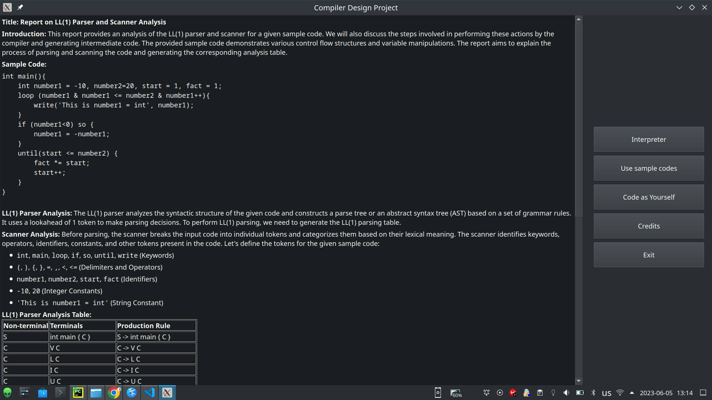
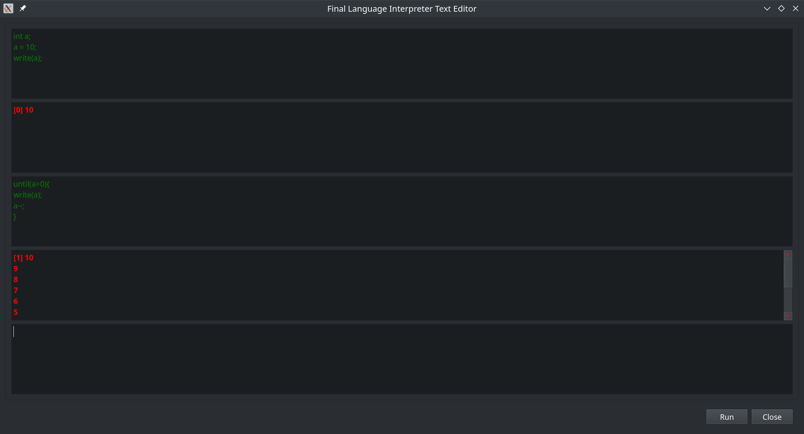
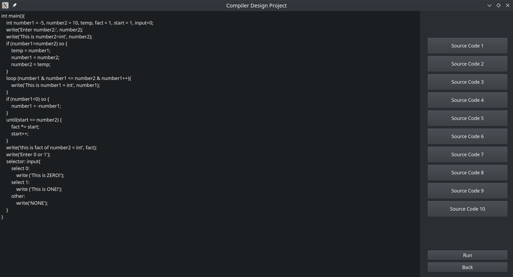
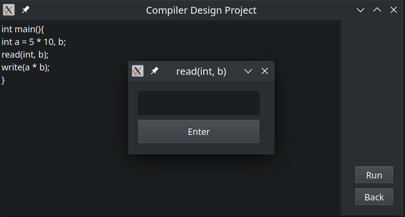
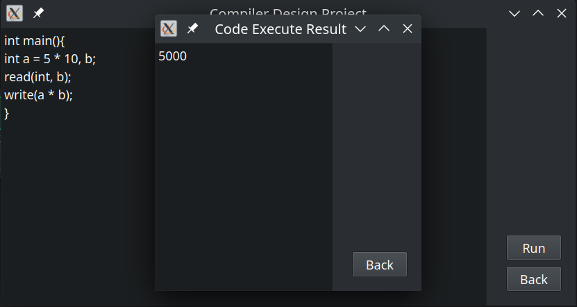

# Compiler Design Project

This project implements a compiler for a custom programming language. The compiler consists of a user interface where users can write and execute code, and a backend that performs lexical analysis, parsing, and code execution.

## Project Structure

The project has the following directory structure:

```
├── backend
│   ├── code_execute.py
│   ├── finalVisitor.py
│   └── interpreter.py
├── UI
│   ├── CodeAsYourSelf.py
│   ├── CreditPage.py
│   ├── InterPreter.py
│   ├── mainWindow.py
│   ├── ResultWindow.py
│   └── sample_codes.py
├── final.g4
├── README.md
```

- The `backend` directory contains the backend logic of the compiler, including modules for code execution, visitor pattern implementation, and interpreter.
- The `UI` directory contains the user interface components of the compiler, such as windows for code input, result display, and sample codes.
- The `final.g4` file defines the grammar rules for the custom programming language.
- The `README.md` file provides an overview of the project and its components.

## Usage

To run the compiler, follow these steps:

1. Make sure you have Python installed on your system.
2. Install the required dependencies using the following command:
   ```
   pip install -r requirements.txt
   ```
3. Run the `mainwindow.py` script using Python (GUI):
   ```
   python UI/mainWindow.py
   ```
- If you want to use your sample codes, put your file in `user_code` directory and then run `rawcompile.py`
- ```
   python UI/rawcompile.py
   ```
4. The Compiler Design Project window will open.
5. Choose one of the available options:
   - **Interpreter**: Opens the interpreter window where you can enter and execute code interactively.
   - **Use sample codes**: Displays a window with a selection of sample codes that you can run.
   - **Code as Yourself**: Allows you to input your own code and run it.
   - **Credits**: Displays the credits page with information about the project.
   - **Exit**: Closes the application.

## ScreenShots







## Contributing

Contributions to the project are welcome! If you find any issues or have suggestions for improvements, please open an issue or submit a pull request on the project's GitHub repository.

## License

The project is licensed under the [MIT License](https://opensource.org/licenses/MIT).
